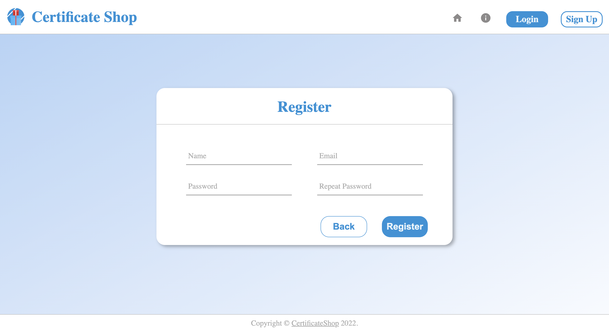

# Gift Certificate Shop (Front)

Copyright &copy; 2022, Aliaksandr Shavialianchyk shevelyanchik.alex@gmail.com

## Description

Web application that performs the functionality of an online store of gift certificates. This application contains both
user's and administrator's parts. You can read about the separation of functionality below.

* Users have the ability:
    * to view all actual gift certificates;
    * to get information about each gift certificate;
    * to view information about gift certificates store;
    * to view their shopping cart;
    * to view their personal account.
* Administrators have all user abilities (except for viewing the shopping cart) and some next for managing application
  data:
    * to add new gift certificates;
    * to edit existing gift certificates;
    * to delete existing gift certificates;
    * to search by search term and category and viewing gift certificates;
    * to search by search term and category and viewing users.

***

## Application example

This web-app service includes the following pages and corresponding functionality:

### Home Page

On this Page You can view actual gift certificates and view info about specific ones details. It is possible to go to
the next pages: About the Application, Signup, Authentication. After successful authentication You will be able to go to
the shopping cart and to your personal account or logout.

### About the Application

On this Page You can view info about Gift Certificate Shop.

### Signup

On this Page You can fill the information about yourself required in the form and register in the application. After
successful registration you will be redirected to the lLogin page. All fields of the registration form are validated so
if any error occurs, a message will immediately be displayed to eliminate it.

### Authentication

On this Page You can fill required account information. Once logged in You will have access to all pages that require
authentication. This Login page also uses some cool inline validation with informing about errors and ways to eliminate
them.

### Profile

On this Page You can view Personal Info.

### Shopping Cart

On this Page You can view your orders: view certificates in detail or remove them from the order. (made as template,
business logic for this functionality will be implemented in the future)

### Gift Certificates Management (Admin)

On this Page You can view all actual gift certificates, get information about each of them, add new gift certificates,
edit existing gift certificates, delete existing gift certificates, search by search term and category and viewing gift
certificates.

1. Add new Gift Certificate

2. Edit Gift Certificate

3. View Gift Certificate

4. Delete Gift Certificate

### Users Management (Admin)

On this Page You can view all actual users, get information about each of them, search by search term and category.

***

## Application requirements

* The Latest version of React
* EcmaScript, JSX [introducing-jsx](https://reactjs.org/docs/introducing-jsx.html)
* Node & NPM
* HTML5 and The Latest version of CSS
* Development Environment: Visual Studio Code or any
* Routing in application: transitions between pages handled by a
  react-router. [introducing-react-router](https://reacttraining.com/react-router/native/guides/quick-start)
* Data fetching. HTTP requests to server: [axios](https://axios-http.com/docs/intro)
* Data storage in UI application: [redux](https://redux.js.org/)
* Site theme & UI components: [react-bootstrap](https://github.com/react-bootstrap/react-bootstrap)
* Localization: en - English
* Errors: all forms must be validated, all occurring errors such as 404 or 403 server response should be handled
